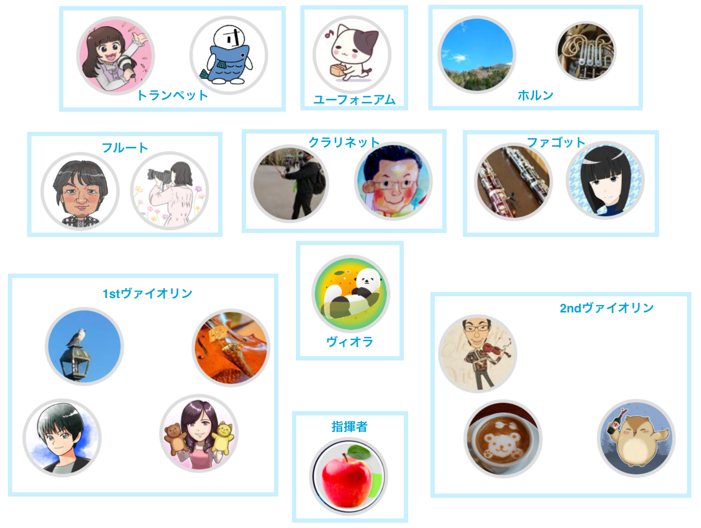

# リベ大オーケストラ

<!-- TODO: リベオケの紹介文を記入してください -->

## リベオケとは

リベオケ（リベ大オーケストラ）は、リベ大が好きな人たちの集まるオンラインコミュニティ「リベシティ」のメンバーが、有志で結成したオーケストラです。

住んでいる場所も、年齢も、職業もバラバラなメンバーが、オンラインとオフラインを行き来しながら練習を重ねています。

私たちを結びつけているのは、「学長に演奏をプレゼントしたい」というシンプルな想い。その一心で、これまで演奏活動を続けてきました。

## これまでの活動の歴史

### 2022
- X月：リベ大オーケストラ結成
- 04月：第一回リベ大フェス2022 中央ステージ出演
    

### 2023
- 07月：第2回リベ大フェス2023 に合わせて会場近くのホテルで演奏会
フェス会場でもエンタメブースで演奏
    

### 202X
- XX月：ひらかたパークオフで演奏

### 2025
- 08月：リベ大フェス2025 エンタメブースで演奏

### 2024
- 10月：神戸アンサンブル会を開催

### 2025
- 06月：第一回横浜アンサンブル会を開催

### 2026
- 06月：第2回横浜アンサンブル会を開催
    
    

